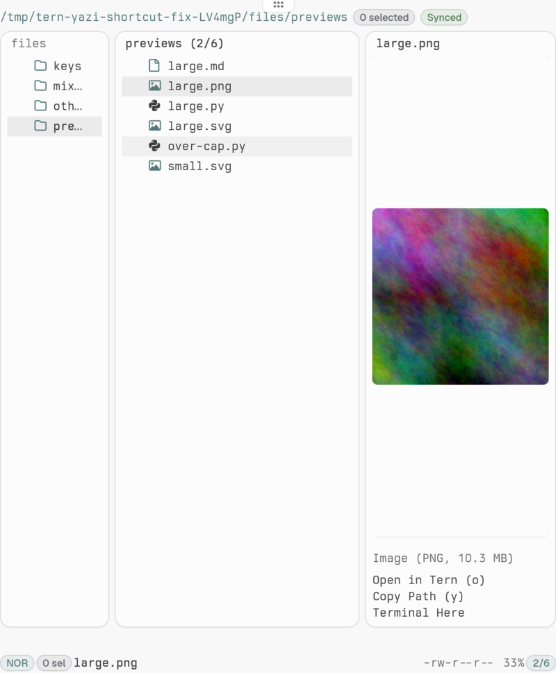

# tern-yazi

Native Tern companion for Yazi · Yazi 原生 Tern 伴随面板



## Requirements / 环境

- Linux · Tern 0.7.0 · Yazi + Ya 26.9.1
- `tern`, `yazi`, `ya` on `PATH` · 同机运行，共用 `XDG_RUNTIME_DIR`
- Nerd Font for file icons · 文件图标使用 Nerd Font

## Install / 安装

```sh
git clone https://github.com/Liushenwuzhu-Alpaca/tern-yazi.git
cd tern-yazi
tern plugin link "$PWD"
mkdir -p "$HOME/.config/yazi/plugins"
ln -s "$PWD/yazi-plugin/tern.yazi" "$HOME/.config/yazi/plugins/tern.yazi"
```

Add to your Yazi `init.lua`, then restart Yazi / 在 Yazi `init.lua` 添加，随后重启 Yazi：

```lua
require("tern"):setup()
```

Open with **Ctrl+Alt+Y** or **Yazi: Toggle Companion Panel** / 使用快捷键或命令面板打开。

## Features / 功能

- Three-column browsing; click to preview, double-click to enter or open · 三列浏览，单击预览，双击进入或打开
- Yazi selection marks, visual selection and task status · 多选标记、可视选择与任务状态
- Images/SVG, Markdown, Mermaid and highlighted code · 图片、图表与代码预览
- Configurable preview limits: **Yazi: Configure Preview Limits** · 可配置预览读取大小
- `j/k`, `h/l`, `g/G`, PageUp/PageDown navigation · 键盘导航
- `/` filtering, `.` hidden files, `;` shell input, `:` manager commands · 过滤、隐藏文件切换与命令输入
- `d` exact-path Trash confirmation, `y` yank, path copy and archive tools · 精确路径回收站确认、复制与归档操作
- Floating and tiled panels · 浮动与平铺面板

## 尚未实现 / Pending

- Ctrl+D/U/F/B and Shift+PageUp/Down routing in Tern · Tern 组合键路由
- Dedicated create, rename, paste, search and tab shortcuts · 创建、重命名、粘贴、搜索与标签页专用快捷键
- Client picker and connection-health status · 客户端选择与连接健康状态
- PDF, audio and video preview · PDF、音频与视频预览

[Development guide / 开发文档](DEVELOPMENT.md)
